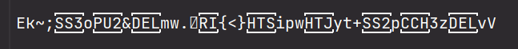

<h1>Encriptador de arquivo.txt 📜</h1>

<h2>Definição 🗿</h2>
O encriptador transforma informações em códigos secretos (cifras), que só podem ser lidas por quem possui as chaves para desencriptar os dados.

<h2>Aplicações 📎</h2>

|  |  |
| ------: | -----------: |
| senhas | sistemas             |
|  dados | assinaturas digitais |
| arquivos | criptomoedas       |

<h2>Como usar 🤔</h2>

| **Objetivo** | **Onde** |
| ------: | -----------: |
| Escrever a entrada ✍️| <kbd>"arquivos/entrada/arquivoEntrada.txt"</kbd>  |
| ver criptografado 🔣    | <kbd>"arquivos/saida/criptografados.txt"</kbd>    |
| ver descriptografado 📰️ | <kbd>"arquivos/saida/descriptografados.txt"</kbd> |

<h2>Exemplo </h2> 

  